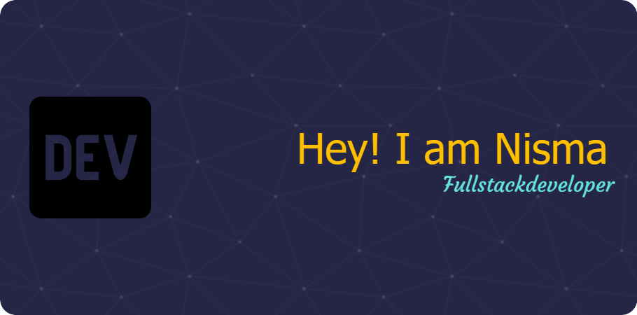

Hey, I am Nisma Hossain. I am a full stack mern developer. I consider myself as a learner. I aim to learn more about web development and making useful websites. Currently, I am well aware of React, Mongo DB, Express Js, Javascript.

## 💫 Liitle Bit More About Me

🌱 I'm currently learning Next JS, Python

🌱 More About me on <a href="https://github.com/nisma687">My Portfolio</a>

🌱My Resume <a href="https://github.com/nisma687/nisma687/blob/main/Nisma-Hossain-Resumed-1.pdf">here</a>

⚡ Fun Fact: I love to explore things,helping people to learn from my experience and Travel.I can speak 3 language.

## 💻 Languages & FrameWorks

## 👥 Connect With Me

## 📊 Github Status

